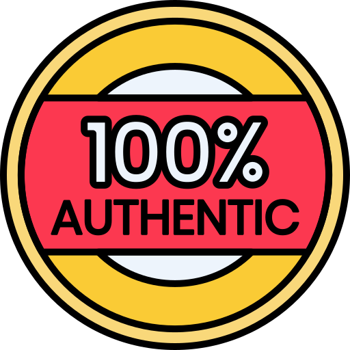

<!-- Inspired by https://github.com/jennifertakagi/REPO_NAME -->

<!-- PROJECT SHIELDS -->
[![Contributors][contributors-shield]][contributors-url]
[![Forks][forks-shield]][forks-url]
[![Stargazers][stars-shield]][stars-url]
[![Issues][issues-shield]][issues-url]
[![MIT License][license-shield]][license-url]
[![LinkedIn][linkedin-shield]][linkedin-url]

<!-- PROJECT LOGO -->
<br />
<p align="center">
  <a href="https://github.com/jennifertakagi/next-auth">
    
  </a>

  <h3 align="center">Next Auth</h3>

  <p align="center">
    A simple application to handle with authentication using JWT
    <br />
    <a href="https://github.com/jennifertakagi/next-auth"><strong>Explore the docs »</strong></a>
    <br />
    <br />
    ·
    <a href="https://github.com/jennifertakagi/next-auth/issues">Report Bug</a>
    ·
    <a href="https://github.com/jennifertakagi/next-auth/issues">Request Feature</a>
  </p>
</p>


<!-- TABLE OF CONTENTS -->
<details open="open">
  <summary>Table of Contents</summary>
  <ol>
    <li>
      <a href="#about-the-project">About The Project</a>
      <ul>
        <li><a href="#built-with">Built With</a></li>
      </ul>
    </li>
    <li>
      <a href="#getting-started">Getting Started</a>
      <ul>
        <li><a href="#prerequisites">Prerequisites</a></li>
        <li><a href="#installation">Installation</a></li>
      </ul>
    </li>
    <li><a href="#roadmap">Roadmap</a></li>
    <li><a href="#contributing">Contributing</a></li>
    <li><a href="#license">License</a></li>
    <li><a href="#contact">Contact</a></li>
    <li><a href="#acknowledgements">Acknowledgements</a></li>
  </ol>
</details>


<!-- ABOUT THE PROJECT -->
## About The Project

A simple application to handle with authentication using JWT

Features:
* Login system using JWT
* Logout including broadcast on all browser tabs


### Built With

* [Axios](https://github.com/axios/axios)
* [JWT Decode](https://jwt.io/)
* [Nookies](https://github.com/maticzav/nookies)
* [Next JS](https://nextjs.org/)
* [React JS](hhttps://reactjs.org/)
* [TypeScript](typescriptlang.org/)


<!-- GETTING STARTED -->
## Getting Started

### Prerequisites

* npm
  ```sh
  npm install npm@latest -g
  ```

* yarn
  ```sh
  npm install --global yarn
  ```

### Installation

1. Clone the repo
   ```sh
   git clone https://github.com/jennifertakagi/next-auth.git
   ```
3. Install packages
   ```sh
   yarn | npm install
   ```
3. Run the following commands in root folder start the application in a development environment:
   ```sh
   yarn dev | npm run dev
   ```

<!-- ROADMAP -->
## Roadmap

See the [open issues](https://github.com/jennifertakagi/next-auth/issues) for a list of proposed features (and known issues).


<!-- CONTRIBUTING -->
## Contributing

Contributions are what make the open source community such an amazing place to be learn, inspire, and create. Any contributions you make are **greatly appreciated**.

1. Fork the Project
2. Create your Feature Branch (`git checkout -b feature/AmazingFeature`)
3. Commit your Changes (`git commit -m 'Add some AmazingFeature'`)
4. Push to the Branch (`git push origin feature/AmazingFeature`)
5. Open a Pull Request


<!-- LICENSE -->
## License

Distributed under the MIT License. See `LICENSE` for more information.


<!-- CONTACT -->
## Contact

Jennifer Takagi - [@jennitakagi](https://twitter.com/jennitakagi)


<!-- ACKNOWLEDGEMENTS -->
## Acknowledgements
* [ESLint](https://eslint.org/)
* [Prettier](https://prettier.io/)


<!-- MARKDOWN LINKS & IMAGES -->
<!-- https://www.markdownguide.org/basic-syntax/#reference-style-links -->
[contributors-shield]: https://img.shields.io/github/contributors/jennifertakagi/next-auth.svg?style=for-the-badge
[contributors-url]: https://github.com/jennifertakagi/next-auth/graphs/contributors
[forks-shield]: https://img.shields.io/github/forks/jennifertakagi/next-auth.svg?style=for-the-badge
[forks-url]: https://github.com/jennifertakagi/next-auth/network/members
[stars-shield]: https://img.shields.io/github/stars/jennifertakagi/next-auth.svg?style=for-the-badge
[stars-url]: https://github.com/jennifertakagi/next-auth/stargazers
[issues-shield]: https://img.shields.io/github/issues/jennifertakagi/next-auth.svg?style=for-the-badge
[issues-url]: https://github.com/jennifertakagi/next-auth/issues
[license-shield]: https://img.shields.io/github/license/jennifertakagi/next-auth.svg?style=for-the-badge
[license-url]: https://github.com/jennifertakagi/next-auth/blob/master/LICENSE.txt
[linkedin-shield]: https://img.shields.io/badge/-LinkedIn-black.svg?style=for-the-badge&logo=linkedin&colorB=555
[linkedin-url]: https://linkedin.com/in/jennifertakagi
